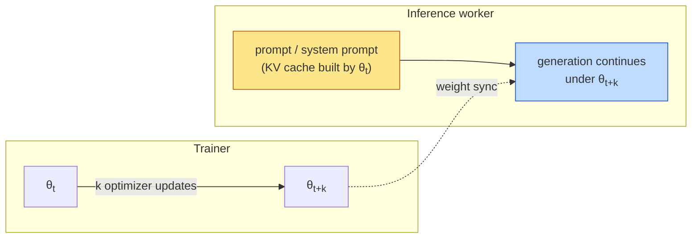
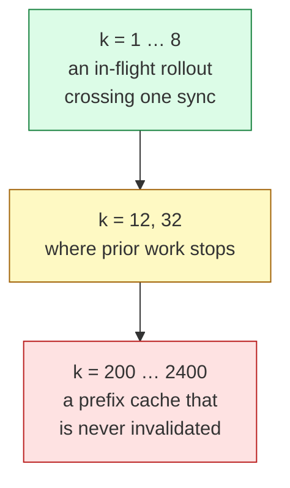
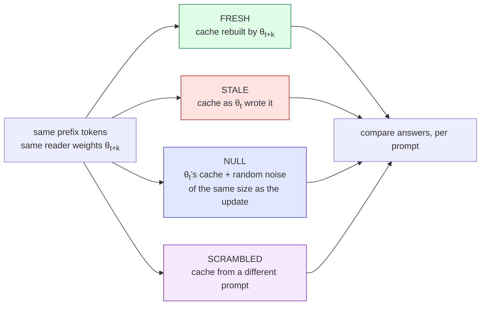

# lag-ladder

**Holdover: The Shelf Life of a KV Cache Across Policy Updates** (working title) — what happens to a
language model's KV cache when the weights change underneath it.

## The situation, in one picture

Modern RL training for language models runs generation and training as two loops. The trainer keeps
producing new weights; the inference workers keep generating. When the trainer pushes a new checkpoint,
the workers already hold a **KV cache** — the attention state for every token they have processed so
far — and that cache was computed by the *old* weights.



The engine has two choices at that moment:

| choice | what it costs | who does it |
|---|---|---|
| **Recompute** the cache under the new weights | GPU time on every sync | AReaL, Laguna, AsyncOPD, StaleFlow |
| **Keep** the old cache and carry on | unknown — this is the question | PipelineRL, Magistral, Nemotron 3 Super, Olmo 3 |

Both camps state their choice; only one measurement exists (one divergence curve, 32 updates deep, one
model). Nobody reports *where* "it does not matter" stops being true, and nobody reports it in task
units.

## The ladder

The independent variable is **k**: how many optimizer updates separate the weights that wrote the
cache from the weights that read it. We read the same quantities at every rung.



The long end matters because of the **prefix cache**: a shared system prompt, tool schema or few-shot
block stays cached across every sync unless something clears it, so its age is unbounded. The short end
is the in-flight rollout that straddles a single sync.

## What we measure at each rung

| question | statistic | how |
|---|---|---|
| **(A)** How much of the cache is stale? | f\*(τ) — the fraction of tokens an oracle would have to recompute to bring the cache inside a tolerance τ | cache dumps only; no generation |
| **(B)** Does the trainer notice? | stale-vs-fresh importance ratio and effective sample size | teacher-forced log-probs |
| **(C)** Does the task notice? | paired exact-match accuracy, stale minus fresh, with a bootstrap interval | generation under each cache |

τ is inherited from [linear-ceiling](https://github.com/hossainpazooki/linear-ceiling), where the same
statistic was calibrated on a cache carried across a change of *context* (the paper *Carryover*). Here
the context is held fixed and only the weights move.

## The experiment: one prompt, four caches

For each prompt, the old weights generate part of an answer. The new weights then finish it — reading
one of four caches for the shared prefix. The tokens are identical across arms, so any difference is
the cache.



- **FRESH vs STALE** is the question.
- **NULL** asks whether any weight change of that size would do the same — or whether RL updates are special.
- **SCRAMBLED** must fail. If it does not, the instrument cannot see the cache and no "holds" result is read.

## Where the ladder runs

- **OLMo-2-0425-1B-RLVR1** — thirteen published checkpoints, 200 updates apart, out to 2,400. The long end.
  This is the pilot: statistic (A) alone, dumps only, decides whether the lane is worth the rest.
- **An own RL run** — one checkpoint per optimizer step, for the short end. Deferred until the pilot shows signal.

## Status

Nothing has run. The repo holds the design, the ledger machinery and the pins; the first registered
hypothesis is the pilot's. See `docs/handoff/HANDOFF.md` for where things stand and what is next.

## How the record stays auditable

- `ledger/ledger.md` — numbered, dated, immutable entries; hypotheses registered before any run;
  every entry hashes the ones above it, and CI refuses an edit to a committed entry.
- `ledger/predictions/` — sealed pre-run predictions (`python -m lag_ladder.seal`).
- `config/*.toml` — every seed and threshold; nothing numeric lives in code.
- `UPSTREAM.md` — the pinned instrument, the (unpinned) checkpoint producer, and where each copied
  module came from.
- Numbers reach the ledger only through a fail-closed summarizer that recomputes them from `results/`.

The scope sentence, held verbatim: The ladder measures what a KV cache written under one policy
checkpoint costs when read under a later one, as a function of how many optimizer updates apart they
are; it does not train on stale rollouts and does not measure serving latency.

## Setup

```
python3.12 -m venv .venv
.venv/bin/python -m pip install -e ".[dev]"     # Windows: .venv/Scripts/python.exe
.venv/bin/python -m pytest -q
```

## Docs

- `docs/2026-09-19-holdover-design.md` — the design, its rulings and the build order.
- `docs/handoff/` — read-this-first briefs; `docs/learnings/` — what we found out the hard way.
- Inherits `linear-ceiling/docs/2026-09-02-e-rl-design.md` for the instrument, controls and dumps,
  and `linear-ceiling/docs/gpu-experiment-protocol.md` for every GPU run.
